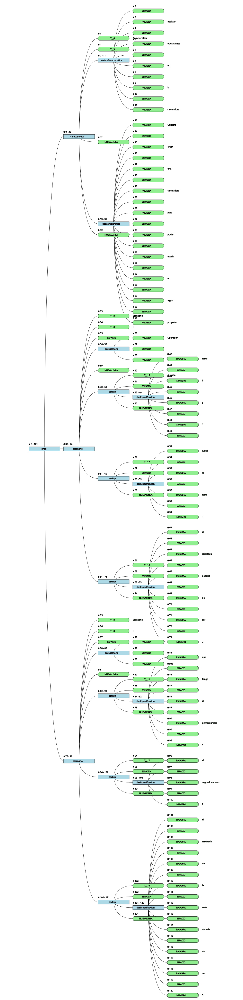

## Transpilador Specscript para Javascript Jest
Convierte un lenguaje natural Specscript para realización de pruebas de código Node usando la librería Jest.

En el archivo __input.sps__ se puede escribir el codigo Specscript se va a transpilar.

La estructura gramatical se encuentra en __SpecscriptGrammar.g4__. 

### Árbol Sintáctico (Parser)

Imagen del Árbol Sintáctico creado a partir de __input.sps__:

